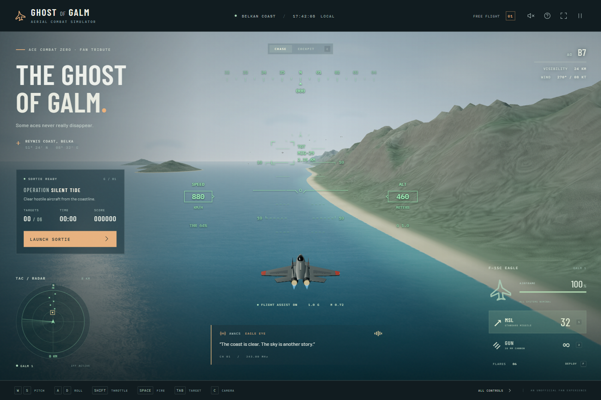

# The Ghost of Galm

A playable, unofficial **Ace Combat Zero** fan tribute built with Three.js and Vite. Fly an F-15C over a procedural coastline, sandy beaches, offshore islands, and mountains in **Operation Silent Tide**.



## Run locally

Use a modern Node.js release and a browser with WebGL enabled.

```sh
npm install
npm run dev
```

Open the local address printed by Vite. For a production build:

```sh
npm run build
npm run preview
```

The static production site is generated in `dist/`.

## Optional Pixy text conversation (M6)

Gameplay works with the conversation service offline. Chat lives at the upper
left above the mission panel and is also accessible inside Flight Operations,
intermission and pause/result dialogs. Press **Enter** from flight or click
**CHAT**; **Enter** sends, **Shift+Enter** adds a newline, and **Escape** returns
input to flight. Flight continues while typing; typing never fires weapons or
activates flight shortcuts. **Tab** keeps its normal behavior inside chat.
Replies animate over at most eight seconds; click the reply or **Reveal full
message** to display it immediately. Reduced-motion preferences skip animation.
The PX callsign frame is a placeholder, not a canonical portrait.

In a second terminal, from the repository root (Python 3.11+):

```powershell
python -m venv .venv
.\.venv\Scripts\Activate.ps1
python -m pip install -r server/requirements.txt
Copy-Item .env.example .env
python -m uvicorn server.app:app --host 127.0.0.1 --port 8000
```

If PowerShell blocks activation, use `.venv\Scripts\python.exe` directly instead
of `python`. On macOS/Linux, activate with `source .venv/bin/activate` and use
`cp .env.example .env`. Start the frontend separately with `npm install` then
`npm run dev` (`npm.cmd` also works on Windows).

By default, Pixy's conversation backend uses Gemini 3.1 Flash-Lite. Add your
Google AI Studio key to the ignored `.env` file as `GEMINI_API_KEY=...`. The key
is read only by Python on the backend and is never sent to browser code. Gemini
receives the canonical lorebook, approved game context and bounded conversation
history with each request. Free-tier quota and availability are controlled by
Google; failures continue to show the existing comms-unavailable message.

Ollama remains available as a local alternative. Install and run
[Ollama](https://ollama.com/download) separately, then download the configured
model:

```sh
ollama pull qwen3:8b
ollama serve
```

Run `ollama serve` only if Ollama is not already serving locally. Neither Ollama
nor Qwen is bundled in the web build. To use Ollama, select it in `.env`:

```dotenv
WINGMAN_LLM_PROVIDER=ollama
WINGMAN_LLM_MODEL=qwen3:8b
WINGMAN_LLM_BASE_URL=http://127.0.0.1:11434
```

Keep `.env` private; Git ignores it. Provider/model configuration never enters
frontend code. Vite development and preview proxy `/api/wingman/chat` to port
8000. A static production deployment needs its own same-origin reverse proxy
for `/api/wingman/*`; the backend is intended for local development, not public
unauthenticated hosting. No wildcard CORS is enabled.

`server/providers/base.py` defines the replaceable async provider interface.
The Gemini adapter uses Google's [GenerateContent REST API](https://ai.google.dev/gemini-api/docs/generate-content/text-generation),
server-side key authentication, constrained JSON output and minimal thinking.
The Ollama adapter uses its documented [chat API](https://docs.ollama.com/api/chat),
structured JSON, and disabled [thinking output](https://docs.ollama.com/capabilities/thinking).
Only validated final dialogue is returned as `{text, mode, emotion}`; emotion is
an allowlisted mumble style hint, never displayed. Full responses arrive once,
then animate locally. Microphone and STT remain future scope.

The backend reads [the canonical lorebook](docs/wingman/lorebook.md) directly from
the repository on each request. It is not copied into JavaScript or the web
bundle. Larry calls the current player **Kid**; current-operation labels use
**PILOT 1** and **PIXY**. Cipher and Galm 2 remain historical identities.

The dedicated `buildWingmanContext()` allowlist contains exactly:

- `mode`: COMBAT, INTERMISSION or HANGAR. READY maps to HANGAR; ROUND_CLEAR
  maps to INTERMISSION; GAME_OVER maps to COMBAT for later conversation context.
  Pause retains its underlying phase's mode.
- `wingman`: nullable `{aircraft, hp, maxHP, alive, state, special}`. Special is
  NONE, READY, ACTIVE or COOLDOWN. Preflight may have no active aircraft yet.
- `contacts`: at most 16 `{type, bearing, range, selected}` records. Only living,
  non-hidden contacts within 8 km in 3D, without an explicit `detected: false`,
  qualify; preflight/hangar sends none. Bearings round to 10°, ranges to 500 m.
  This is stricter than the existing radar's distant edge markers.
- `events`: at most eight allowed confirmed event names from the last 60 seconds.
  No event carries player condition, kill counters or an enemy's hidden state.

Player HP, ammo, score, future encounters, hidden contacts, input and mutable
objects are omitted. The backend rejects unknown fields. Dialogue/history is
separate untrusted content and cannot become system instructions or confirmed
telemetry. The local browser supplies context; this is not server-authoritative
multiplayer validation.

History stays in this page's memory: up to 12 messages (six exchanges), further
limited to 6,000 characters in both frontend and backend. Reloading or starting
a replacement run clears it. Initial preflight discussion carries into round 1.
Failed/cancelled requests do not become dialogue history. Confirmed gameplay
events provide limited tactical continuity when the player next asks. Routine
kills, hits and game over never create automatic LLM replies. AWACS stays on
its own channel.

Requests have a 25-second browser deadline and the configurable backend deadline
(20 seconds by default). Cancel, phase changes and run transitions discard stale
responses; send is disabled while pending. Longer backend timeouts also require
adjusting the browser deadline in `wingman-client.js`. Provider/model failures,
timeouts and malformed responses show exactly
`COMMS INTERRUPTED. TEMPORARILY UNAVAILABLE.` and play a short procedural static
effect when sound is enabled. There is no canned Larry fallback.

Backend checks require no Ollama or model download:

```sh
python -m unittest discover -s server/tests -v
```

For an explicitly synthetic browser/API check only, use
`python -m uvicorn server.tests.mock_app:app --host 127.0.0.1 --port 8000`
instead of the normal backend. Its test dialogue is never selected automatically
or used as a fallback. See [M6 validation](docs/m6-validation.md) for evidence and
limits; real Qwen personality and prompt-resistance evaluation still need local
inference on a machine running Ollama.

## Wingman audio architecture (M7-A)

LLM chat remains text. Larry's reply reveals one word at a time; the same
typing timeline calls a small browser-generated Web Audio mumble grain for each
visible word. The sound is nonverbal, uses no samples or network request, and
is optional through **CHAT MUMBLE**. Global mute overrides it. Comma, sentence
ending, question, exclamation and ellipsis timing follow the word reveal.
Controlled mode and emotion enums change its envelope and pitch slightly.
Reveal full message, close chat, mute and run changes stop it. Reduced-motion
mode reveals text immediately and plays no mumble.

Automatic gameplay events no longer ask Gemini or Ollama for reactions. They
remain in the allowlisted recent context for a later player message.
**3** orders PIXY to **ATTACK**, restoring normal proactive local combat.
**4** orders **REGROUP**, clearing his target and returning toward formation
while terrain avoidance and evasion remain active. HUD buttons provide mouse
and touch access. Commands work only in active unpaused combat with a living
wingman. A new run or replacement aircraft starts in ATTACK; the order
otherwise persists across rounds. Typing in chat never issues an order.

Confirmed gameplay events and accepted commands route to a separate
WingmanRadioDirector. It selects clean prerecorded MP3 files from a validated
manifest using context filters, weighted choice, priorities, cooldowns and
no-repeat rules. The contexts are STANDARD, ELITE and BOSS, with encounter ID
and optional phase ID hooks. Bounded preload/cache avoids decoding the whole
library. Runtime Web Audio applies radio filters and flight ducking. Higher
priority can interrupt lower priority. Ambient is randomized and eligible only
during standard combat after sufficient silence. AWACS text stays separate.
The [radio directory guide](docs/wingman/prerecorded-radio.md) documents the
tree, manifest schema and semantic filenames.

M7-A includes empty pools and **no Pixy MP3 files**. Gameplay radio is silent
until M7-B integrates approved recordings and tunes playback by listening.
There is no neural TTS, voice-cloning inference or TTS endpoint.
[M7-A validation](docs/m7a-validation.md) records checks and limits. The
[earlier TTS experiment](docs/m7-validation.md) is historical only.
## How to play

Select **Launch Sortie**, choose PIXY's aircraft in Flight Operations, then launch round 1, a six-aircraft Silent Tide patrol. PILOT 1 remains the procedural F-15C. Destroy every hostile to clear the round, then select the next engagement and **Continue Sortie**, or open **Hangar / Change PIXY** first. Rounds have no final limit; losing PILOT 1 ends the run.

Health, missiles, flares, aircraft position, and flight state carry between rounds. There is no intermission repair or rearm; the cannon has unlimited ammunition. PIXY's HP, destruction and weapon cooldowns also persist. Combat and its timers stop during intermission/hangar. Closing the encounter dialog leaves the run suspended; **Select Engagement** reopens it. Closing the hangar returns to the selected encounter. **Fly Again** after aircraft loss, or **Restart Run** from pause, opens aircraft selection for a fresh run.

Use **Tab** to select a living hostile, then **L** (or touch **LOCK**) to request missile lock. Keep it within the existing forward/range envelope for 0.65 seconds: **ACQ** becomes **LOCK**. Missiles require completed lock. Press L again to cancel; cycling or destroying the target clears the request. Leaving the envelope resets acquisition but retains your request for that same target. The cannon needs no lock. Deploy flares when a missile warning appears, and keep clear of terrain.

PIXY follows a formation offset, independently engages enemies, breaks defensively when threatened, and regroups after losing a target. Its local deterministic AI uses shared missiles and cannon hits; wingman kills count toward round completion and score. Enemies alternate their existing timed missile threats between nearby friendly aircraft. Wingman loss does not end your run or trigger an automatic replacement next round.

| PIXY aircraft | HP | Missile / cannon damage | Special |
| --- | --- | --- | --- |
| The Ghost of Galm (default) | 1,500 | 30 / 3 per bullet | None |
| Pixy's Prototype | 2,000 | 30 / 3 per bullet | Linear Laser: 50 damage/sec, 5 sec burst, 120 sec cooldown |

The laser follows the aircraft's forward axis from its configured emitter and damages the nearest intersecting hostile. It stops on wingman loss or combat end. Cooldown starts at activation and advances only during combat. **Provisional hangar rule:** confirming a different wingman aircraft supplies a full-health replacement with fresh weapon timers. Keeping the same aircraft preserves its damage or destruction. Opening the hangar never repairs/rearms PILOT 1.

Available encounters:

| Encounter | Category | Contacts | Durability | Reward per aircraft |
| --- | --- | --- | --- | --- |
| Silent Tide | Standard | 6 | 1 missile / 3 cannon hits | 1,200 |
| Border Patrol | Standard | 3 | 1 missile / 3 cannon hits | 1,200 |
| Elite Flight | Elite prototype | 4 | 2 missiles / 6 cannon hits | 2,200 |
| Heavy Contact | Boss prototype | 1 | 4 missiles / 12 cannon hits | 6,000 |

Elite and Boss use the existing procedural aircraft and patrol behavior with different stats. They do not include advanced AI, boss phases, or special weapons.

The HUD includes a pitch ladder, compass, airspeed, altitude, targeting cues, weapons, square radar, and aircraft status. The heading-relative radar retains its 8 km scale and north marker, clamps distant contacts to square edges, and distinguishes PILOT 1's center symbol, cyan PIXY diamond/“2”, hostile dots and the amber selected hostile. Hold **V** to look behind from Chase or Cockpit; release restores the selected camera immediately. Sound starts muted; use the speaker button to enable the synthesized engine and combat effects.

| Input | Action |
| --- | --- |
| W / Up arrow | Pitch up |
| S / Down arrow | Pitch down |
| A / D or Left / Right arrows | Bank and turn |
| Q / E | Rudder left / right |
| Shift | Afterburner |
| B | Air brake |
| Space | Fire selected weapon |
| Tab | Cycle living hostile targets; clear lock |
| L | Request / cancel missile lock |
| 1 / 2 | Select missiles / cannon |
| F | Deploy flares |
| C | Switch chase / cockpit camera |
| V (hold) | Rear view; release to restore selected camera |
| Enter | Open chat; send while typing (Shift+Enter inserts a newline) |
| Escape while chatting | Close chat and return flight input |
| Esc / P | Pause or resume outside chat |
| H | Show flight controls |

Small screens and larger touchscreens show steering, fire, target and LOCK buttons. Weapon/camera buttons and the flight-controls dialog remain available. Leaving the browser tab pauses an active sortie.

## Project files

- `src/main.js`: flight controls, combat, rendering, and interface integration.
- `src/game/state.js`: run state and phases; pause is a separate suspension flag.
- `src/game/round-director.js`: run lifecycle, round transitions, kill ownership, rewards, and detached snapshots.
- `src/game/encounters.js`: immutable encounter catalog and composition expansion.
- `src/combat/enemies.js`: procedural encounter spawning and disposal of replaced aircraft.
- `src/ui/intermission.js`: encounter selection interface.
- `src/ui/hangar.js`: preflight/intermission wingman selection.
- `src/aircraft/catalog.js`: aircraft stats, normalization, collision radii and wrapper-local hardpoints.
- `src/aircraft/assets.js`: procedural/GLB visual loading, local Draco decoder and visible fallback; disposal on replacement.
- `src/aircraft/attachments.js`: local-to-world hardpoints and forward direction.
- `src/aircraft/wingman.js`: deterministic formation/engagement/evasion/regrouping, HP and weapons, lightweight laser effect.
- `src/combat/damage.js`: centralized unit conversion and forward beam intersection.
- `src/combat/manual-lock.js`: manual lock request/acquisition lifecycle.
- `src/world.js`: procedural terrain, ocean, sky, and aircraft geometry.
- `src/hud.js`: canvas flight instruments and tactical radar.
- `src/audio.js`: procedural Web Audio engine and combat sounds.
- `src/style.css`: responsive interface styling.

## Development checks

Run `npm test` for the lightweight Node tests and `npm run build` for production validation. No test dependency is required. Tests cover consecutive rounds, kill ownership, hangar transitions, deterministic wingman flight, weapons, laser duration/cooldown, damage/destruction, hardpoints, manual locking, square radar bounds and snapshot isolation. See [M4–M5 validation](docs/m4-m5-validation.md) for browser checks and their limits.

`window.__flight.getState()` returns a detached debugging snapshot, including phase, round, score, kill sources, encounter and flight telemetry, selected wingman aircraft, HP/alive/AI/target state, weapon timers, model loading status/normalization, manual lock and rear view. It exposes no mutable simulation or Three.js references.

Round progression is `READY → HANGAR → COMBAT → ROUND_CLEAR → INTERMISSION → COMBAT`, with optional `INTERMISSION → HANGAR → INTERMISSION → COMBAT` and `GAME_OVER` on player loss. Pause remains separate. RoundDirector checks living enemies independently of kill ownership. Add compositions and stats to the encounter catalog to define another encounter.

M1–M6 are implemented within the current scope: one fixed player aircraft, two wingman choices and optional text conversation. M7-A adds synchronized procedural chat mumble, deterministic wingman commands and an empty manifest-driven prerecorded radio scaffold. Real MP3s arrive in M7-B. Final Elite/Boss mechanics, advanced dogfighting, physical landing, microphone/STT and saves remain out of scope. `boss_air-destroyer.glb` remains untouched at the repository root for M9.

## Aircraft assets and combat units

The supplied wingman GLBs live in `public/assets/aircraft/wingman/`. Both use Draco compression; GLTFLoader and the decoder/WASM come from the existing Three.js package and are bundled locally. No CDN or new dependency is required. Only the selected GLB is loaded. Failed loading produces a console error, HUD notice and visible procedural substitute.

Original geometry, skinning and materials remain intact. A wrapper applies a 180° yaw correction, centers the exported bounds and scales the models to 24 m (Ghost) / 27 m (Pixy) in length, comparable to the procedural aircraft. Pixy's duplicated deployed landing-gear/refueling nodes are hidden at runtime. Attachments use normalized wrapper coordinates: +X right, +Y up, −Z forward. Missile/cannon/laser origins are transformed into world space at use time.

Catalog HP/damage are authoritative. The adapter uses **10 wingman HP = 1 existing combat unit**: a 30-damage wingman missile deals 3 existing enemy HP, a 3-damage bullet deals 0.3, and the laser deals 5/sec. A legacy 24-unit incoming hit deals 240 wingman HP. Player weapons, enemy HP and their existing time-to-kill are unchanged. Wingman cannon rate/AI and replacement rules remain tuning items.

Scenery, player/enemy aircraft, interface and flight sounds remain procedural. Wingman visuals are supplied external assets; their authorship/license/redistribution terms still need to be recorded before public distribution. Draco's bundled decoder is Apache-2.0 licensed (see the Three.js package's `examples/jsm/libs/draco/README.md`). No soundtrack or voice recordings are included. This is an independent fan project, unaffiliated with Bandai Namco. Ace Combat and related names belong to their respective owners.
